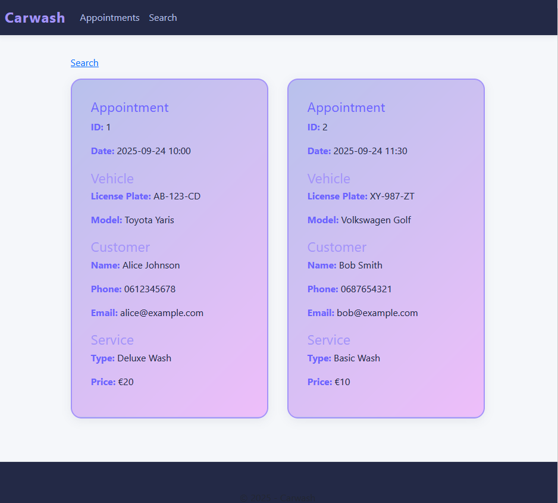
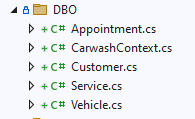

## Carwash

```
 Een auto wasstraat heeft een oude database, normaal werdt deze op oude computers met een console getoond
 De eigennaar wil nu de afspraken op modernere systemen laten draaien, de oude zijn namelijk aan vervangen toe

 de eigennaar wil graag het web gebruiken zodat dit later ook op de website getoond kan worden.
 voor nu moet het alleen intern
```

# Technische vereisten:
- Gebruik C# 
- gebruik de aangeleverede SQLITE database 
- Maak een overzicht van de data op een webpagina, de data moet gelezen worden uit de database
- Zorg voor een zoek functie op klant telefoon nummer
    - de zoek functie & het resultaat moet een andere pagina staan
- gebruik de carwash.db in files
    > 

## bewijzen & leerdoelen:
- Je kan (tech skills):
    - database code laten genereren met het Entity Framework
    - data via code ipv SQL uitvragen
    - relaties tussen tabellen via code uitvragen zonder sql


##### technisch
- gebruik een C# website met razor
- Gebruik het Entity Framework en database scaffolding om de CarwashContext te genereren
- zoek uit hoe je uit een DbSet<> data kan halen
- zoek uit hoe je van LINQ de Where kan gebruiken
- zoek uit hoe je relaties via LINQ kan uitvragen van het hoofdobject
- zoek uit hoe je de gegenereerde code in een aparte folder zet:
    > 
- zoek uit hoe je geen dubbel .cshtml maakt
    > dus geen dubbele html voor je appointments lijst
## git
- maak een aparte git repository aan voor dit project, geef dit een goede naam waar minimaal de naam van het vak in voorkomt:
    - M1Prog_cs
    
## opleveren

- je levert een werkend programma op
- je maakt een presentatie van je product
- je ontwikkelt een korte presentatie alsof je leraar bent en legt daarin uit hoe je de ERD gemaakt hebt en je keuzes daarin

