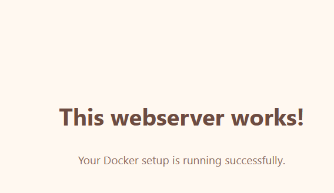

## docker

- lees:
```
dit is een voorbereidende opdracht, we moeten docker leren kennen want die gebruiken we op deze opleiding

De klant heeft een docker omgeving waar we containers met compose kunnen maken. Voordat we aan de opdrachten beginnen moeten we deze technologie even leren kennen
```

## opdracht:

- Wij beginnen met een basis webserver opzetten:
    > 

- installeer docker desktop
- zoek uit hoe je docker compose files maakt en gebruikt om container stacks te maken 

- gebruik de volgende Template onder de hints om een nginx server in docker te maken waar je een index.html kan tonen

```YML
services:
 NAAM:
     image: WELKE IMAGE HEB JE NODIG
     container_name: prog_m5_TYPE
     environment:
        title: waarde
        INTERNE CONSTANTEN
     ports:
        - EXTERN:INTERN
        - 9999:80
     links:
        - IS DEZE CONTAINER GEKOPPELD AAN EEN ANDERE CONTAINER?
     volumes:
         - './:/var/www/html'
     depends_on:
         - HEEFT DEZE CONTAINER EEN ANDERE CONTAINER NODIG?

```

## Nginx

- als je docker werkt en je ziet het welkomst scherm zoek dit uit:
    - nginx heeft ook een basis configuratie nodig zoek die, bekijk die en probeer die te begrijpen
    - zorg dat je zelf een index.html (met css) de docker container in krijgt
    - laat die tonen
        > 

## git
- maak een aparte git repository aan voor dit project, geef dit een goede naam waar minimaal de naam van het vak in voorkomt:
    - M1Prog_docker
        
## opleveren

- je levert een werkend programma op volgens de specificaties op
- alles staat in git
