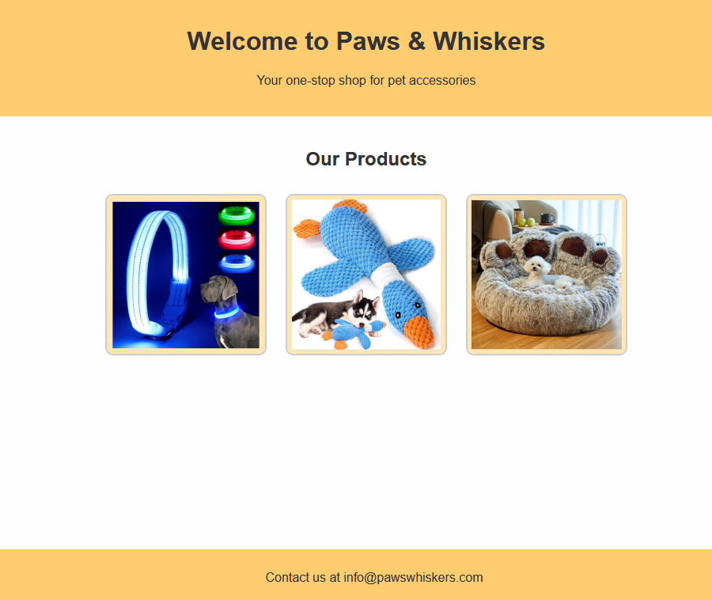

## docker

- lees:
```
Andere webserver. Soms heeft een klant een andere webserver nodig. Apache httpd is 1 van die servers. 

## Casus:

De klant heeft een mini website aangeleverd die via docker in de cloud gezet moet worden. Op de oude server gebruikte de klant apache httpd.
Deze wil de klant behouden. De klant wil een docker zien waar de oude site in draait.
- Zorg voor jou nieuwe klant voor een docker apache webserver container waar de http bestanden ingezet kunnen worden
```

## opdracht:


- gebruik de oude website en docker compose om een container stack met de oude website te laten draaien
    - de zip onder files (files/pets.zip) bevat de oude site

```YML
services:
 NAAM:
     image: WELKE IMAGE HEB JE NODIG
     ports:
        - EXTERN:INTERN
        - 9999:80
     volumes:
         - './BUITEN:/BINNEN'

```


## git
- maak een aparte git repository aan voor dit project, geef dit een goede naam waar minimaal de naam van het vak in voorkomt:
    - M1Prog_docker
        
## opleveren

- je levert een werkend programma op volgens de specificaties op
    - je kan dit laten zien via docker:
        > 
- alles staat in git
