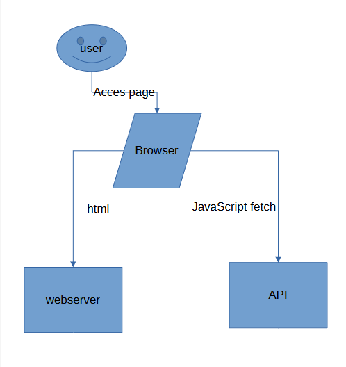
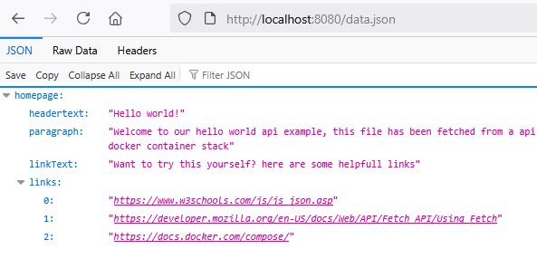
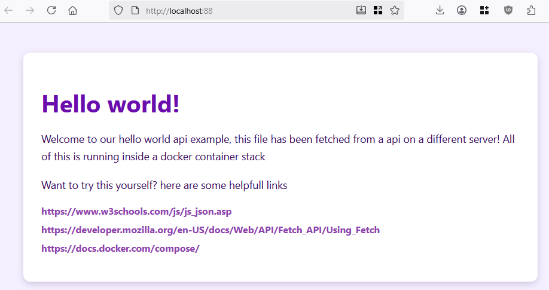

## docker

- lees:
```
Je weet hoe je een nginx of apache server moet opzetten, tot nu toe hebben we maar 1 container in de compose stack gebruikt.

## Casus:
De volgende klant wil een voorbeeld hebben van hoe ze in docker hun website and api kunnen hosten op aparte machines.

Dat hebben ze nu ook, maar ze willen geen servers huren en makkelijk kunnen opschalen. Als je deze opdracht goed uitvoert wordt jullie bedrijf misschien gehuurd om de het hele applicatielandschap naar de cloud te verhuizen!

De klant wil graag het volgende zien:
- 1 webserver met een site die verbind met de API
- de API geeft data terug waarmee html via javascript getoond wordt
- de API moet apart draaien, dus op een andere server
```


## Technisch

- voor het gemak is er een example json meegeleverd als API data
    - files/data.json
- een plaatje voor het landschap:
    > 
- maak gebruik van 2 nginx services in je docker compose file
- gebruik fetch om de json data op je page te zetten als html
- zorg ervoor dat je je depends_on gebruikt
    > Welke container is van welke afhankelijk?
- voor nu mag je alleen de data.json hosten
    > 
    - als je verder wil gaan, gebruik php als webapi en lees daarmee de data.json in

    

## git
- maak een aparte git repository aan voor dit project, geef dit een goede naam waar minimaal de naam van het vak in voorkomt:
    - M1Prog_docker
        
## opleveren

- je levert een werkend programma op volgens de specificaties op
    - je kan dit laten zien via docker:
        > 
- alles staat in git

