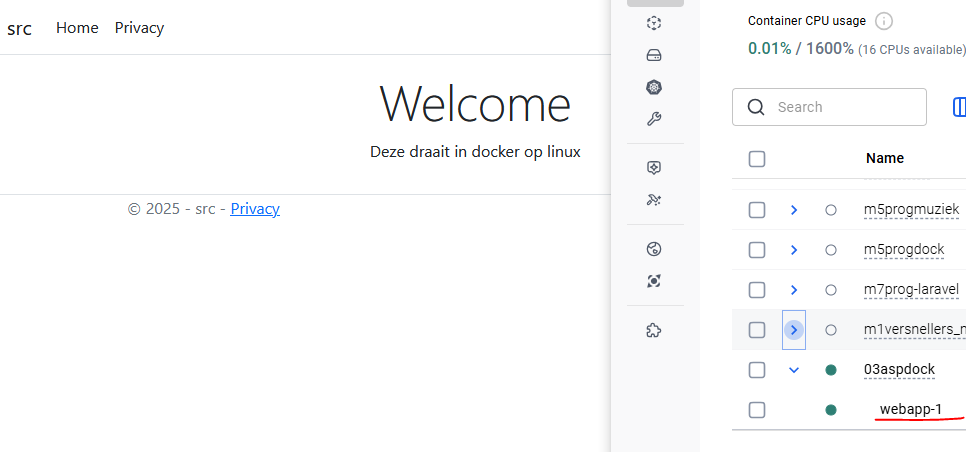

## docker

- lees:
```
Wat kunnen we nog meer met docker? laten we dat eens uitzoeken

deze keer geen klant maar een interne uitzoek opdracht.

Voor de outsourcing company waar je werkt moet je uitzoeken hoe je met docker een aspcore app kan draaien.

Er worden veel applicaties verhuist naar de cloud met een docker infrastructuur dus is het hebben van deze kennis een oppertunity om nieuwe klanten te werven
```


## Technisch

- zoek uit hoe je een aspdotnet applicatie voor linux kan publiseren 
- zoek uit hoe je een asp web app in docker laat draaien

- je static files (css in de wwwroot) moeten werken

- gebruik de docker compose in files/03 dotnet/
    

## git
- maak een aparte git repository aan voor dit project, geef dit een goede naam waar minimaal de naam van het vak in voorkomt:
    - M1Prog_docker
        
## opleveren

- je levert een werkend programma op volgens de specificaties op
    - je kan dit laten zien via docker:
        > 
- alles staat in git

